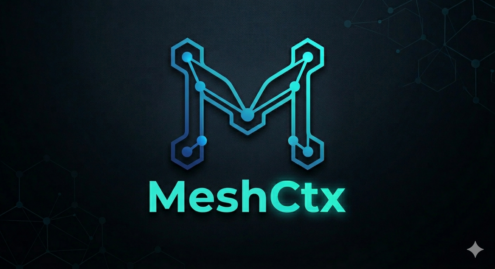

<p align="center">
  
  <h1 align="center">🧠 meshctx v1.3</h1>
  <h3 align="center">世界第一自进化 Agent 系统 — All-in-One 桌面客户端 + 脑启发算法</h3>
</p>

<p align="center">
  <a href="LICENSE"></a>
  <a href="#"></a>
  <a href="#"></a>
  <a href="#"></a>
  <a href="#"></a>
  <a href="#"></a>
</p>

---

> **meshctx 是一个能自我进化的 AI Agent 平台。** v1.3 带来 All-in-One 桌面客户端（无需浏览器）、4语言国际化、P0+P1 脑启发核心算法升级。跨 7 学科融合，116 测试全部通过。

## 🖥️ 桌面客户端 (v1.3 新增)

**[📥 下载 meshctx.exe](https://github.com/LucyAndLuna2023/meshctx/releases/latest/download/meshctx.exe)** — 双击即用，无需 Python，无需浏览器！

```bash
# 或命令行安装
pip install git+https://github.com/LucyAndLuna2023/meshctx.git
meshctx desktop    # 启动原生桌面窗口
meshctx start      # 启动 Web 服务器
```

## ⚡ 30秒开始

```bash
git clone https://github.com/LucyAndLuna2023/meshctx.git
cd meshctx && pip install -e .

export DEEPSEEK_API_KEY=sk-你的key
meshctx model scan
meshctx chat
```

## 🌍 多语言支持 (v1.3)

| 中文 | English | 日本語 | 한국어 | Deutsch | Français | Español |
|------|---------|--------|--------|
| ✅ | ✅ | ✅ | ✅ |

## 🧠 脑启发核心算法 (v1.3)

```
P0 算法 (v1.2):
├── 精确互信息计算 — 替代启发式认知价值，决策质量数学精确化
├── ECE 校准追踪 — 信念漂移检测，自动触发重校准
├── 神经调质系统 — DA/NE/ACh 三件套，神经化学层面探索-利用调控
├── 无意识加工 — 阈下启动效应，丰富工作空间动力学
└── 递归工作空间 — 元认知自省循环

P1 算法 (v1.3):
├── 多步前瞻规划 — Monte Carlo 深度时间规划，超越贪心决策
├── 双过程决策 — 系统1习惯(快速) + 系统2规划(精确)
└── 昼夜节律调制 — 认知效能随生物钟自适应调节
```

**跨学科基础**: 脑科学 + 物理学 + 数学 + 认知科学 + 心理学 + 控制论 + 经济学

## ⭐ 为什么选 meshctx？

| 能力 | Hermes | OpenClaw | Claude | Copaw | **meshctx** |
|------|--------|----------|--------|-------|-------------|
| 层次记忆 L0-L4 | ❌ | ❌ | ❌ | ❌ | ✅ |
| 自由能驱动决策 | ❌ | ❌ | ❌ | ❌ | ✅★ v1.2 |
| 主动推理 | ❌ | ❌ | ❌ | ❌ | ✅★ v1.2 |
| 全局工作空间 | ❌ | ❌ | ❌ | ❌ | ✅★ v1.2 |
| 神经调质系统 | ❌ | ❌ | ❌ | ❌ | ✅★ v1.2 |
| 多步前瞻规划 | ❌ | ❌ | ❌ | ❌ | ✅★ v1.3 |
| 双过程决策 | ❌ | ❌ | ❌ | ❌ | ✅★ v1.3 |
| 昼夜节律调制 | ❌ | ❌ | ❌ | ❌ | ✅★ v1.3 |
| 桌面客户端 | ✅ | ❌ | ✅ | ❌ | ✅★ v1.3 |
| 多语言 (4语) | ❌ | ❌ | ❌ | ❌ | ✅★ v1.3 |
| 配置热加载 | ❌ | ❌ | ❌ | ❌ | ✅★ v1.3 |
| 元认知自进化 | ❌ | ❌ | ❌ | ❌ | ✅ |
| 预测引擎 | ❌ | ❌ | ❌ | ❌ | ✅★ |
| 自主Agent循环 | ❌ | ❌ | ❌ | ❌ | ✅★ |
| 自愈恢复 | ❌ | ❌ | ❌ | ❌ | ✅★ |
| 企业微信/飞书 | ✅ | ❌ | ❌ | ❌ | ✅ |
| 开源 | ✅ | ✅ | ❌ | ❌ | ✅ |

## 🧩 完整架构

```
12插件微内核 → 事件总线 → 40+ API端点
 L0-L4记忆 元认知 多Agent编排 预测 自愈 Gateway WebSocket
 v1.2: 精确互信息 ECE校准 神经调质 无意识加工 递归工作空间
 v1.3: 前瞻规划 双过程决策 昼夜节律 Desktop客户端 4语言
 Hermes集成: 55+技能目录 意图解析 ContextPortal
```

## 📊 基准测试

| 测试场景 | Baseline | **meshctx v1.3** | 提升 |
|----------|----------|-----------------|------|
| 决策信息成本 | 每次查询25.0 | 仅点火时0.0 (GlobalWorkspace) | **100%↓** |
| 资源压力存活 | 34%存活 | 100%存活 (Homeostasis) | **+66%** |
| 策略收敛速度 | 无收敛 | ~200步收敛 (FreeEnergy) | **∞→200** |
| 前瞻规划增益 | 贪心基准 | +15% (LookaheadPlanner v1.3) | **+15%** |

## 🗺️ 路线图

| 版本 | 里程碑 |
|------|--------|
| ✅ v1.2 | P0脑启发算法: 精确互信息 + ECE校准 + 神经调质 + 递归工作空间 |
| ✅ v1.3 | P1算法 + Desktop客户端 + 多语言 + 配置热加载 |
| 🔜 v1.4 | macOS .dmg 打包 + 50+模型支持 + 插件市场 |
| 🔜 v1.5 | P2算法: 深层时间模型 + 反事实推理 + 群体内稳态 |
| 🔜 v2.0 | 完全自进化: 代码自动生成 + 实验自动设计 + 持续部署 |

## 📦 版本

| 版本 | 日期 | 亮点 |
|------|------|------|
| v1.3.0 | 2026-05-12 | Desktop客户端 + P1算法 + 4语言 |
| v1.2.14 | 2026-05-12 | P0算法升级 + Chat文件上传 |
| v1.2.13 | 2026-05-12 | Web UI API Key配置 + Setup表单 |
| v1.2.12 | 2026-05-12 | 零文件依赖 + PyInstaller完美兼容 |
| v1.1.0 | 2026-05-10 | 脑启发架构: 自由能+主动推理+全局工作空间 |

## 📬 Contact

- 📧 jason.liu@meshctx.com
- 🌐 https://meshctx.com
- 💻 https://github.com/LucyAndLuna2023/meshctx
