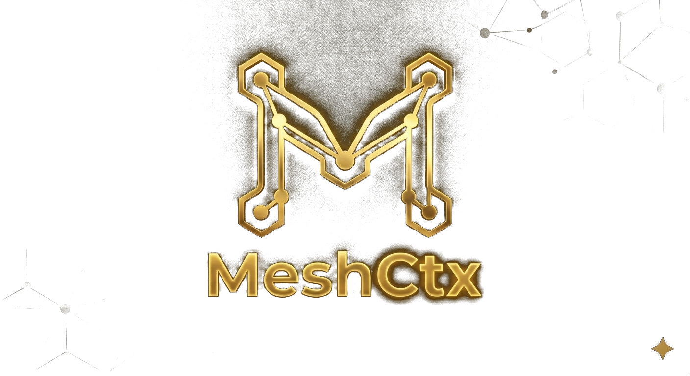

<p align="center">
  
  <h1 align="center">🧠 MeshCtx v3.115.31</h1>
  <h3 align="center">世界第一全脑仿真自进化AI Agent · SDM突破性记忆 · 自修改代码 · 全量测试 · 17脑区 · 17模块 · Swarm代码生成 · 11工具链</h3>
</p>

<p align="center">
  <a href="LEGAL.md"></a>
  <a href="#"></a>
  <a href="#"></a>
  <a href="#"></a>
  <a href="#"></a>
  <a href="#"></a>
  <a href="#"></a>
</p>

---

## 🚀 快速安装

### Windows
```powershell
# 下载安装程序 (推荐)
# 访问 https://github.com/LucyAndLuna2023/meshctx/releases/latest
# 下载 meshctx-setup.exe — NSIS安装向导，7语言，一键安装

# 或便携版
# 下载 meshctx-portable.zip 解压即用
```

### Linux / WSL
```bash
curl -fsSL https://cdn.jsdelivr.net/gh/LucyAndLuna2023/meshctx@main/install.sh | bash
# 安装完成后配置API密钥
meshctx setup
```

### macOS
```bash
# 下载 DMG 安装包
# https://github.com/LucyAndLuna2023/meshctx/releases/latest
# 下载 meshctx-macos.dmg

# 或 Homebrew
brew install meshctx
```

### 启动
```bash
meshctx start          # 启动Web服务 (默认 http://localhost:3001)
meshctx chat           # 命令行对话
meshctx setup          # 配置API密钥和模型
meshctx desktop        # Windows桌面客户端
```

---

## 🧠 核心特性

### 多模型自由切换 (v3.115.25) 🆕
- **每会话独立模型**: 每个对话窗口可选择不同AI模型，切换会话自动恢复
- **Web UI 下拉菜单**: 聊天页顶部一键切换，实时生效
- **CLI 斜杠命令**: `/model deepseek:v4-pro` 切换，`/model` 查看当前，`/models` 列出可用
- **跨平台统一**: Linux / Windows / macOS 浏览器访问同一套 Web UI

### 脑启发AI引擎
- **17脑区全脑仿真**: 自由能原理 · 主动推理 · 全局工作空间 · 稳态调节
- **混合推理调度**: 自由能驱动的探索vs直出决策
- **超级大脑**: 海马回放 · 杏仁核情绪标记 · 默认模式网络 · 丘脑门控
- **元认知**: 自我评估 · 错误分类 · 行为调整

### 类人记忆系统 (v2.40)
```
传统AI记忆: 存数据 → 关键词匹配
类人记忆:   模式组块 → 情绪加权 → 海马回放 → 联想扩散
```
- **模式组块**: 像围棋手识别"中国流布局"，压缩原始数据为意义模式
- **情绪加权**: 重要信息(CRITICAL)几乎永不遗忘(衰减200倍慢于日常)
- **海马回放**: 后台5分钟周期重放记忆，自动巩固+发现关联
- **再巩固**: 每次回忆都会更新记忆（人类学习的核心机制）
- **联想扩散**: 记忆通过加权链接传播激活（气味→场景→人→对话）
- **有效遗忘**: 忘掉细节保留模式，遗忘是特征不是bug

### 自主运维引擎 (v2.41)
- 15+指标实时监控（CPU/内存/磁盘/网络/FD/记忆块）
- Z-score异常检测（5σ触发CRITICAL）
- 症状模式匹配 → 根因诊断 → 自动修复
- 修复数据库自学习（成功率追踪）
- 进化日志记录所有事件

### Hooks引擎 (v2.42) — 对标Claude Code
- 8种事件: PreTool · PostTool · Stop · SessionStart · PreCompact · Notification · SubagentStop · UserPrompt
- 通配符匹配: `Bash(git *)` · `Write(*.py)` · 子串匹配
- 安全规则: 默认拦截 `rm -rf` / `git push --force` / `curl|bash`

### 🐝 Agent Swarm — Manager-Worker多Agent协同 (v3.34) 🆕
```bash
# 启动Manager节点
meshctx start --port 3001

# 启动Worker节点 (另一台机器)
curl -X POST http://manager:3001/swarm/register \
  -d '{"worker_id":"bot1","name":"Coder","capabilities":["code"]}'

# 提交复杂任务 — 自动分解→派发→并行执行
curl -X POST http://manager:3001/swarm/execute \
  -d '{"task":"搜索最佳实践+写代码+审查","type":"research"}'
```
- **Manager-Worker架构**: 1个Manager管理N个Worker，通过网络+密钥协同
- **自动任务分解**: research/code/analysis/report 5种模板
- **智能调度**: 能力匹配+最少任务优先+60s心跳超时
- **身份认证**: ed25519密钥对+HMAC签名+5分钟防重放
- **协作协议**: 委托(Delegate) · 投票(Vote) · 共识(Consensus) · 集成(Ensemble)
- 冷却机制: 防重复触发

### Agent团队 (v2.43) — 对标Claude Code @agent
- 6内置角色: Coder · Reviewer · Architect · Tester · Researcher · DevOps
- 4协作模式: Review · Brainstorm · Divide&Conquer · Pipeline
- 并行调度 + 结果聚合

### 多平台Gateway (v2.39)
- 微信企业 · 飞书 · Telegram · Slack · Discord · WhatsApp
- Socket Mode · Webhook · Cloud API
- 统一消息格式 + 多平台广播

### 凭证池轮转 (v2.37)
- 多API Key轮转: round_robin · least_used · random
- 自动标记耗尽Key + 冷却恢复
- 持久化 + 统计

### 使用洞察 (v2.38)
- 按日/周/月追踪: 会话 · 消息 · Token · 延迟 · 错误率
- Provider/Model性能排行
- 峰值时段热力图

---

## 📊 版本演进

| 版本 | 核心交付 | 测试 |
|------|---------|------|
| v2.37 | 凭证池轮转 + 会话管理增强 | 825 |
| v2.38 | 使用洞察分析 | 846 |
| v2.39 | Gateway (Slack/Discord/WhatsApp) | 894 |
| v2.40 | **类人记忆系统** (6机制) | 916 |
| v2.41 | **自主运维引擎** (自愈+进化) | 935 |
| v2.42 | **Hooks引擎** (8事件) | 956 |
| v2.43 | **Agent团队** (6角色+4模式) | 975 |
| v3.115 | **DeepSeek TUI竞品对标** (17模块·4200行) | **130** |

---

## 🏗️ 技术架构

```
meshctx/
├── src/
│   ├── main.py              # FastAPI 主应用
│   ├── web_ui.py            # Web UI 模板
│   ├── cli.py               # CLI 命令行
│   ├── i18n.py              # 7语言国际化
│   └── core/                # 9个核心模块
│       ├── dual_session.py      # Planner/Executor 双session引擎
│       ├── prompt_registry.py   # YAML模板注册表 + 版本化
│       ├── subagent_isolated.py # 子进程真隔离 subagent
│       ├── cost_router.py       # flash/pro 成本分级路由
│       ├── config_chain.py      # 4级TOML配置链覆盖
│       ├── identity_guard.py    # System prompt身份固化
│       ├── tui_format.py        # 6种TUI输出格式注入
│       ├── tool_repair.py       # 7策略JSON修复层
│       └── memory_v5.py         # 4级分级内存注入
├── tests/                   # 130个测试
├── docs/                    # 文档站点
├── install.sh               # Linux一键安装
├── install.bat              # Windows安装脚本
└── index.html               # 7语言主页 (gh-pages)
```
## 🔌 API 端点

### 聊天
- `POST /api/chat` — 对话 (非流式JSON)
- `POST /api/chat/stream` — 流式对话 (SSE)

### 双Session
- `POST /api/dual/plan` — Planner规划
- `POST /api/dual/execute` — Executor执行
- `GET /api/dual/stats` — Session统计

### Prompt注册表
- `GET /api/prompts` — 列出模板
- `POST /api/prompts` — 创建模板
- `POST /api/prompts/{id}/publish` — 发布版本
- `POST /api/prompts/render` — 渲染模板

### Subagent隔离
- `POST /api/subagent/run` — 启动隔离subagent
- `GET /api/subagent/{id}/status` — 查询状态
- `POST /api/subagent/{id}/storm_break` — 强制终止

### 记忆
- `GET /api/memory/stats` — 记忆诊断
- `POST /api/memory/add` — 添加记忆
- `POST /api/memory/search` — 搜索记忆
- `POST /api/memory/set_level` — 设置注入级别

### 成本路由
- `POST /api/cost/select` — 选择路由
- `GET /api/cost/metrics` — 成本度量
- `POST /api/cost/report_error` — 上报错误

---

## 🔒 安全

- **Secret扫描**: 自动检测并脱敏API Key/Token/PII
- **Hooks拦截**: 默认阻止危险命令
- **凭证池**: Key轮转防耗尽
- **审批模式**: YOLO/smart/manual 三级

## 🌐 平台支持

| 平台 | 安装方式 | 状态 |
|------|---------|------|
| Windows | NSIS安装包 (7语言) | ✅ |
| Linux | curl\|bash 一键脚本 | ✅ |
| macOS | DMG + Homebrew | ✅ |
| WSL | 同Linux | ✅ |
| Docker | docker-compose | ⚠️ 待更新 |

## 📄 许可证

框架层: MIT 开源
核心大脑层: 源码可见 · 非商业免费 · 商业需授权
联系: license@meshctx.com
